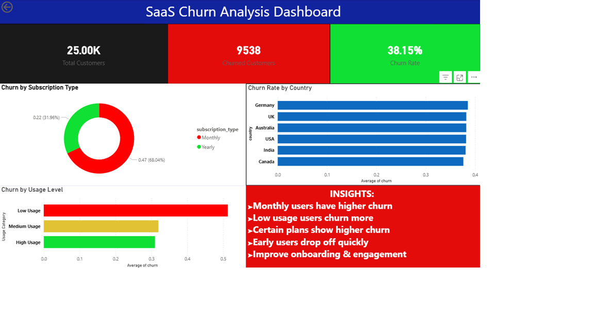

# 📊 SaaS Customer Churn Analysis

---

## Project Overview

This project analyzes customer churn behavior in a SaaS (Software as a Service) business using SQL and Power BI.

The objective is to understand why customers leave, identify high-risk segments, and provide actionable insights to improve customer retention and business performance.

---

## Business Problem

Customer churn is a critical challenge for SaaS companies as it directly impacts revenue and growth.

This project aims to answer:

* What is the overall churn rate?
* Which customer segments have the highest churn?
* How do usage patterns and subscription types affect churn?
* What actions can reduce churn and improve retention?

---

## Dataset Description

The dataset contains customer-level information:

* `customer_id` — Unique customer identifier
* `plan` — Subscription plan (Basic, Standard, Premium)
* `country` — Customer location
* `monthly_usage_hours` — Product usage intensity
* `tenure_months` — Duration of subscription
* `subscription_type` — Monthly or Yearly plan
* `churn` — Target variable (1 = churned, 0 = active)

---

## Key Insights

* Monthly subscription users exhibit higher churn compared to yearly users, indicating lower long-term commitment.

* Customers with low product usage show a significantly higher likelihood of churn, highlighting engagement as a key driver.

* Churn varies across subscription plans, suggesting potential issues in pricing strategy or perceived value.

* Customers in early tenure stages are more prone to churn, emphasizing the importance of onboarding and early experience.

* Improving engagement and encouraging long-term subscriptions can significantly reduce churn.

---

## Dashboard Features

* KPI metrics: Total Customers, Churned Customers, Churn Rate
* Churn analysis by plan, country, usage level, and subscription type
* Clean and interactive Power BI dashboard
* Business-focused insights for decision-making

---

## Tools & Technologies

* SQL (Data analysis and querying)
* Power BI (Data visualization and dashboarding)

---

## Project Structure

SaaS-Churn-Analysis/
│
├── data/
│   └── saas_churn_realistic.csv
│
├── sql/
│   └── saas_churn_analysis.sql
│
├── dashboard/
│   └── dashboard.png
│
└── README.md

---

## Dashboard Preview

## 📊 Dashboard Preview  

---

## Skills Demonstrated

* Data cleaning and analysis using SQL
* Customer churn analysis and retention metrics
* Data visualization and dashboard design (Power BI)
* Business problem solving and insight generation
* Analytical thinking and storytelling

---

## Conclusion

This project demonstrates how data-driven analysis can be used to identify churn patterns, understand customer behavior, and implement strategies to improve retention in a SaaS business.
